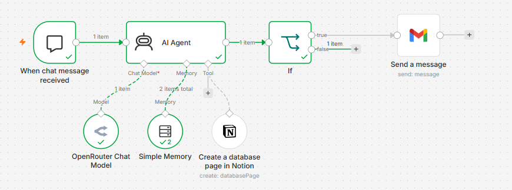
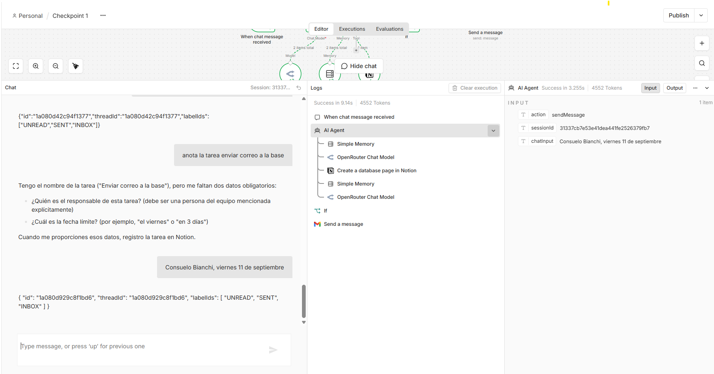
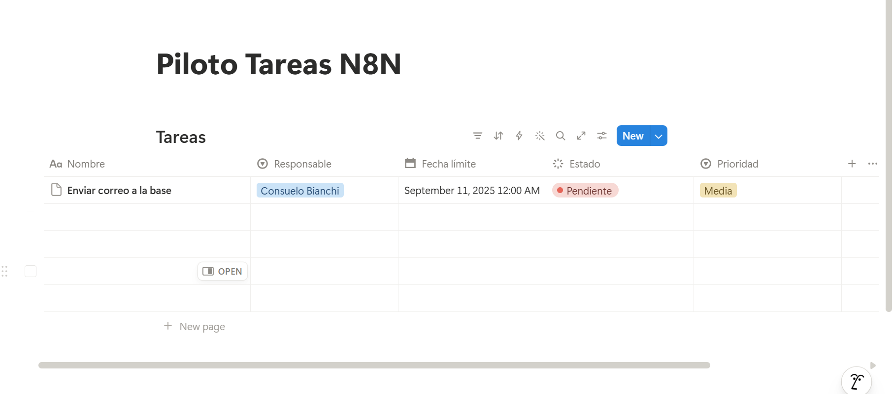
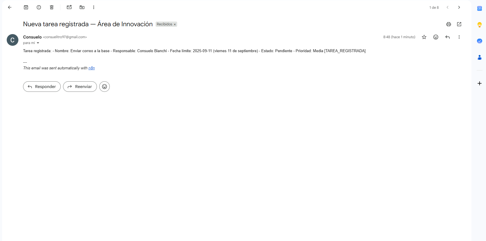

# Checkpoint 1 — Agente Gestor de Tareas del Área de Innovación

Coderhouse "AI Automation Avanzado" — Módulo 1: Fundamentos de Agentes Autónomos

## Descripción

Agente autónomo construido en n8n que recibe solicitudes de tareas por chat (lenguaje natural desestructurado),
extrae los campos obligatorios (Nombre, Responsable, Fecha límite), pregunta si falta información antes de
registrar, y crea la tarea directamente en una base de Notion. Incluye notificación automática por Gmail
como capa de observabilidad.

## Stack técnico

- **Orquestación:** n8n
- **Modelo:** OpenRouter (modelos gratuitos)
- **Herramienta:** Notion (creación de páginas en base de datos)
- **Observabilidad:** Gmail
- **Memoria:** Simple Memory (buffer window) para sostener el flujo de preguntas/respuestas

## Evidencia de funcionamiento

**Flujo completo en n8n:**

**Prueba en chat — pregunta por dato faltante:**

**Tarea registrada en Notion:**

**Notificación recibida por Gmail:**

## Archivo del checkpoint

`checkpoint1_nombre_apellido.json` — exportación completa del flujo de n8n.
